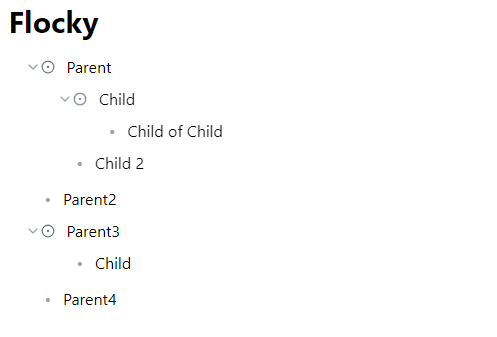

# Flocky
Flocky aims to integrate "block-based" and "zooming in" functionalitu to offer an intuitive note-taking experience. Inspired heavily by https://workflowy.com and https://www.notion.so. 



Flocky is a sleek, intuitive bullet-point note-taking app built with React. It's designed to help you organize your thoughts, ideas, and tasks with ease and style.

## ✨ Features

- 📝 Hierarchical bullet-point structure
- 🔄 Seamless indentation and outdentation
- 🔍 Zoom in/out functionality for focused note-taking
- 🌳 Expandable/collapsible bullet points
- ⌨️ Keyboard shortcuts for efficient navigation (TODO)
- 🎨 Smooth animations for a polished user experience

## 🚀 Getting Started

### Prerequisites

- Node.js (v14.0.0 or later)
- npm (v6.0.0 or later)

### Installation

1. Clone the repository:
   ```
   git clone https://github.com/yourusername/flocky.git
   ```

2. Navigate to the project directory:
   ```
   cd flocky
   ```

3. Install dependencies:
   ```
   npm install
   ```

4. Start the development server:
   ```
   npm start
   ```

5. Open your browser and visit `http://localhost:3000` to see Flocky in action!

## 🎹 Keyboard Shortcuts

- `Enter`: Create a new bullet point
- `Tab`: Indent bullet point
- `Shift + Tab`: Outdent bullet point
- `Arrow Up/Down`: Navigate between bullet points
- `Backspace` (on empty bullet point): Delete bullet point

## 🛠️ Built With

- [React](https://reactjs.org/) - A JavaScript library for building user interfaces
- [Framer Motion](https://www.framer.com/motion/) - A production-ready motion library for React
- [Lucide React](https://lucide.dev/) - Beautiful & consistent icon toolkit made by the community

## 🤝 Contributing

Contributions, issues, and feature requests are welcome! Feel free to check [issues page](https://github.com/kvtys/flocky/issues).

## 📜 License

This project is absolutely not licensed.

## 🙏 Acknowledgements

- Workflowy. Love that app.

---

Made with ❤️ and ☕ by [kvtys](https://github.com/kvtys)